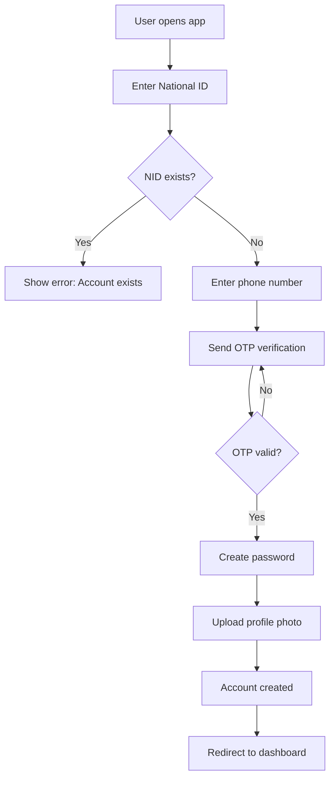
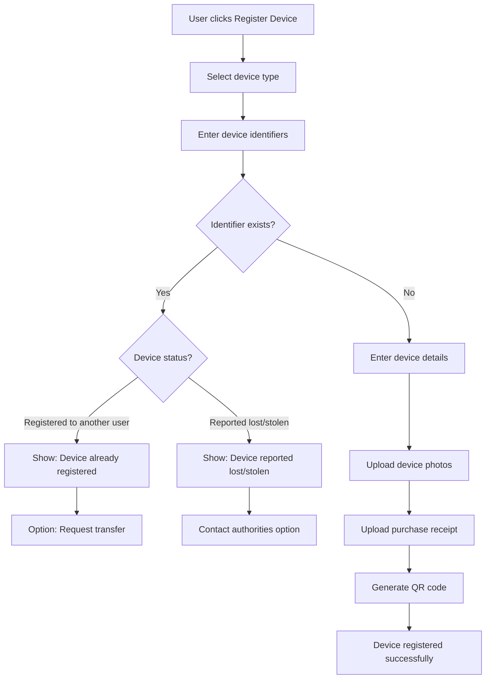
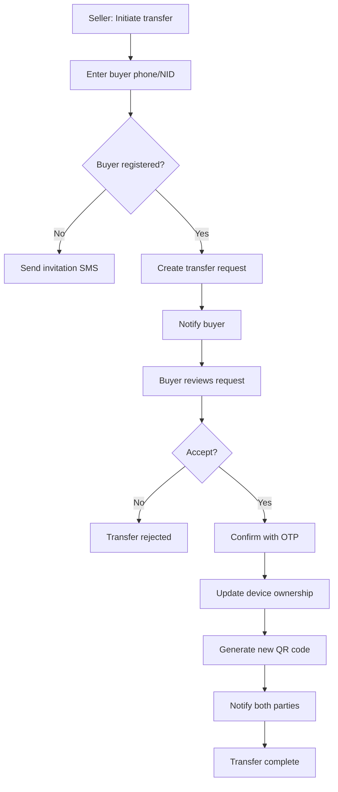
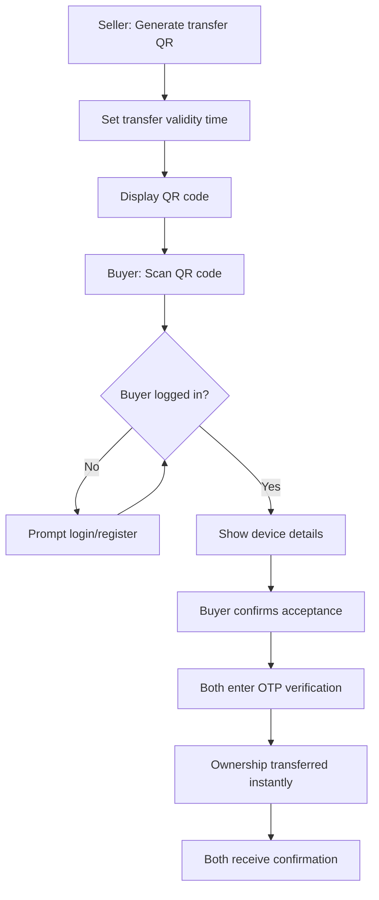
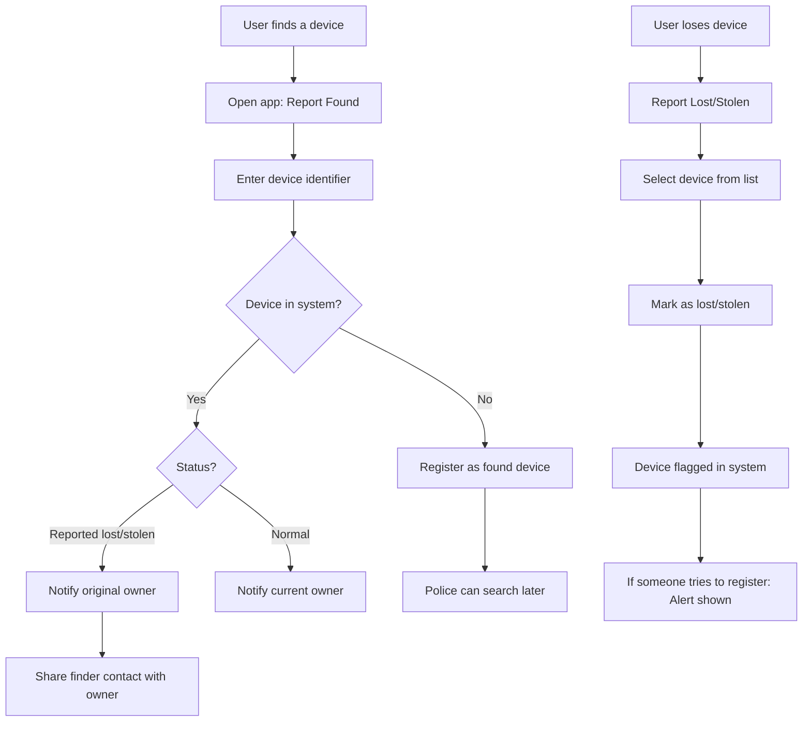

# Rwandan Device Registry and Transfer System (DRTS)

## 1. System Overview

A comprehensive device registration and ownership transfer platform for Rwanda, enabling citizens to register electronic devices, transfer ownership securely, and report lost/found devices. The system aims to reduce device theft and provide law enforcement with a verification tool.

### Problem Statement
- Buyers cannot verify if a device is stolen before purchasing
- Sellers have no way to prove legitimate ownership
- Government/police lack a centralized database for device verification
- Lost devices are difficult to recover due to no tracking of ownership

### Solution
A centralized device registry with:
- Secure device registration linked to National ID
- QR code-based quick transfer system
- Lost and found reporting
- Government/police verification dashboard

---

## 2. Core Features

### 2.1 User Features
- **Device Registration**: Register any electronic device with unique identifiers
- **Ownership Transfer**: Initiate and accept device transfers between users
- **QR Code Transfer**: Generate QR codes for quick face-to-face transfers
- **Transfer History**: View complete ownership history of a device
- **Lost/Found Reporting**: Report lost devices or register found devices
- **Device Verification**: Check if a device is registered/reported stolen

### 2.2 Government/Admin Features
- **Device Search**: Search any device by identifier
- **Ownership Verification**: Verify current and past ownership
- **Stolen Device Alerts**: View all reported stolen/lost devices
- **User Management**: Manage user accounts and disputes
- **Analytics Dashboard**: Statistics on registrations, transfers, theft reports

---

## 3. User Types and Roles

| Role | Description | Permissions |
|------|-------------|-------------|
| **Citizen** | Regular Rwandan user | Register devices, transfer, report lost/found |
| **Verified Seller** | Business/shop owner | Bulk registration, commercial transfers |
| **Police Officer** | Law enforcement | Search, verify, flag devices |
| **Admin** | System administrator | Full access, user management |

---

## 4. Data Models

### 4.1 User Model
```javascript
{
  _id: ObjectId,
  nationalId: String,          // Nida number - unique
  firstName: String,
  lastName: String,
  phoneNumber: String,         // With country code +250
  email: String,               // Optional
  password: String,            // Hashed
  role: enum [citizen, verified_seller, police, admin],
  isVerified: Boolean,
  profilePhoto: String,        // URL to photo
  address: {
    province: String,
    district: String,
    sector: String,
    cell: String
  },
  createdAt: Date,
  updatedAt: Date
}
```

### 4.2 Device Model
```javascript
{
  _id: ObjectId,
  deviceType: enum [phone, laptop, tablet, tv, other],
  brand: String,
  model: String,
  identifiers: {
    imei1: String,             // Primary IMEI for phones
    imei2: String,             // Secondary IMEI (dual SIM)
    serialNumber: String,      // For laptops, TVs, etc.
    macAddress: String         // Optional - WiFi MAC
  },
  description: String,
  purchaseInfo: {
    purchaseDate: Date,
    purchasePrice: Number,
    purchaseLocation: String,
    receipt: String            // URL to receipt image
  },
  currentOwner: ObjectId,      // Reference to User
  status: enum [registered, pending_transfer, transferred, reported_lost, reported_stolen, found],
  qrCode: String,              // Generated QR code data
  photos: [String],            // Device photos URLs
  createdAt: Date,
  updatedAt: Date
}
```

### 4.3 Transfer Model
```javascript
{
  _id: ObjectId,
  device: ObjectId,            // Reference to Device
  fromUser: ObjectId,          // Seller
  toUser: ObjectId,            // Buyer
  transferType: enum [sale, gift, inheritance],
  price: Number,               // If sale
  status: enum [pending, accepted, rejected, cancelled, expired],
  qrCodeUsed: Boolean,
  initiatedAt: Date,
  completedAt: Date,
  expiresAt: Date,             // Transfer request expiry
  notes: String
}
```

### 4.4 Lost/Found Report Model
```javascript
{
  _id: ObjectId,
  device: ObjectId,            // Reference to Device (if registered)
  reportType: enum [lost, stolen, found],
  reportedBy: ObjectId,        // Reference to User
  deviceIdentifier: String,    // IMEI/Serial if device not in system
  location: {
    province: String,
    district: String,
    description: String
  },
  reportDate: Date,
  status: enum [open, investigating, resolved, closed],
  policeReference: String,     // Police case number if applicable
  notes: String,
  createdAt: Date,
  updatedAt: Date
}
```

### 4.5 Verification Log Model
```javascript
{
  _id: ObjectId,
  device: ObjectId,
  verifiedBy: ObjectId,        // Police/Admin who verified
  verificationType: enum [ownership_check, theft_check, transfer_verification],
  result: String,
  notes: String,
  createdAt: Date
}
```

---

## 5. User Flows

### 5.1 User Registration Flow



### 5.2 Device Registration Flow



### 5.3 Device Transfer Flow - Standard



### 5.4 QR Code Quick Transfer Flow



### 5.5 Lost/Found Device Flow



---

## 6. API Endpoints

### 6.1 Authentication
| Method | Endpoint | Description |
|--------|----------|-------------|
| POST | /api/auth/register | User registration |
| POST | /api/auth/login | User login |
| POST | /api/auth/verify-otp | OTP verification |
| POST | /api/auth/forgot-password | Password reset request |
| POST | /api/auth/reset-password | Reset password |
| GET | /api/auth/me | Get current user profile |

### 6.2 Devices
| Method | Endpoint | Description |
|--------|----------|-------------|
| POST | /api/devices | Register new device |
| GET | /api/devices | Get user devices |
| GET | /api/devices/:id | Get device details |
| PUT | /api/devices/:id | Update device info |
| DELETE | /api/devices/:id | Remove device (soft delete) |
| GET | /api/devices/check/:identifier | Check if device exists |
| POST | /api/devices/:id/qr-code | Generate transfer QR code |

### 6.3 Transfers
| Method | Endpoint | Description |
|--------|----------|-------------|
| POST | /api/transfers | Initiate transfer |
| GET | /api/transfers | Get user transfers |
| GET | /api/transfers/:id | Get transfer details |
| PUT | /api/transfers/:id/accept | Accept transfer |
| PUT | /api/transfers/:id/reject | Reject transfer |
| PUT | /api/transfers/:id/cancel | Cancel transfer |
| POST | /api/transfers/qr-scan | Process QR code transfer |

### 6.4 Lost and Found
| Method | Endpoint | Description |
|--------|----------|-------------|
| POST | /api/reports | Create lost/found report |
| GET | /api/reports | Get user reports |
| GET | /api/reports/:id | Get report details |
| PUT | /api/reports/:id | Update report |
| PUT | /api/reports/:id/resolve | Mark as resolved |

### 6.5 Admin/Police
| Method | Endpoint | Description |
|--------|----------|-------------|
| GET | /api/admin/devices/search | Search all devices |
| GET | /api/admin/devices/:id/history | Get ownership history |
| GET | /api/admin/reports | Get all reports |
| PUT | /api/admin/reports/:id/status | Update report status |
| GET | /api/admin/users | List all users |
| GET | /api/admin/stats | Dashboard statistics |
| POST | /api/admin/verify/:deviceId | Log verification check |

---

## 7. QR Code Implementation

### 7.1 QR Code Data Structure
```json
{
  "type": "DRTS_TRANSFER",
  "version": "1.0",
  "deviceId": "device_object_id",
  "transferId": "transfer_request_id",
  "sellerId": "seller_user_id",
  "timestamp": "ISO_date",
  "expiresAt": "ISO_date",
  "signature": "HMAC_signature"
}
```

### 7.2 Security Measures
- QR codes expire after configurable time (default: 15 minutes)
- HMAC signature prevents tampering
- One-time use - invalidated after scan
- Requires both parties to be authenticated
- OTP verification required to complete transfer

### 7.3 Libraries to Use
- **Backend**: `qrcode` npm package for generation
- **Frontend**: `html5-qrcode` for scanning
- **Signature**: `crypto` for HMAC-SHA256

---

## 8. Security Considerations

### 8.1 Authentication
- JWT tokens with short expiry (1 hour)
- Refresh tokens stored securely
- OTP verification for sensitive operations
- Rate limiting on all endpoints

### 8.2 Data Protection
- Password hashing with bcrypt (12 rounds)
- Sensitive fields encrypted at rest
- HTTPS only
- Input validation and sanitization

### 8.3 Device Verification
- IMEI validation format check
- Duplicate detection across the system
- Photo verification for high-value devices
- Suspicious activity flagging

### 8.4 Transfer Security
- Both parties must verify with OTP
- Transfer history is immutable
- Cooling-off period option (24 hours)
- Admin can freeze suspicious transfers

---

## 9. Additional Features to Consider

These features were not mentioned but would enhance the system:

### 9.1 Notifications
- SMS notifications for transfers (critical for non-smartphone users)
- Push notifications for app users
- Email notifications (optional)

### 9.2 USSD Integration
- Allow basic functions via USSD for feature phones
- Device verification: *123#
- Quick transfer confirmation

### 9.3 Dealer/Shop Portal
- Bulk device registration for shops
- Warranty tracking
- Sales reports

### 9.4 Insurance Integration
- Link with insurance companies
- Proof of ownership for claims
- Theft claim verification

### 9.5 Import/Customs Integration
- Register devices at customs entry
- Reduce smuggled goods

### 9.6 Blockchain Consideration
- Immutable ownership history
- Cross-border verification
- Could be Phase 2 enhancement

---

## 10. Tech Stack Recommendation

### Backend
- **Runtime**: Node.js
- **Framework**: Express.js
- **Database**: MongoDB with Mongoose
- **Authentication**: JWT + OTP (twilio/africas-talking)
- **QR Generation**: qrcode npm package
- **File Storage**: AWS S3 or Cloudinary

### Frontend - Web
- **Framework**: React.js or Next.js
- **UI Library**: Tailwind CSS
- **State Management**: React Query
- **QR Scanning**: html5-qrcode

### Frontend - Mobile (Future)
- **Framework**: React Native or Flutter
- **Native QR**: Built-in camera integration

### Infrastructure
- **Hosting**: Vercel (frontend) + Railway/Render (backend)
- **Database**: MongoDB Atlas
- **SMS Gateway**: Africa's Talking (Rwanda supported)

---

## 11. Implementation Phases

### Phase 1: Foundation (MVP)
- [ ] Project setup and architecture
- [ ] User authentication with National ID
- [ ] OTP verification via SMS
- [ ] Basic device registration (phones only)
- [ ] Device duplicate checking
- [ ] Simple transfer request/accept flow
- [ ] Basic user dashboard

### Phase 2: Core Features
- [ ] All device types support
- [ ] QR code generation and scanning
- [ ] Transfer history tracking
- [ ] Lost/stolen device reporting
- [ ] Found device registration
- [ ] Device verification check (public)

### Phase 3: Government Integration
- [ ] Police/admin dashboard
- [ ] Device search and history
- [ ] Report management
- [ ] Analytics and statistics
- [ ] Verification logging

### Phase 4: Enhanced Features
- [ ] Mobile app (React Native)
- [ ] USSD integration
- [ ] Dealer portal
- [ ] SMS notifications
- [ ] Multi-language support (Kinyarwanda, French, English)

### Phase 5: Ecosystem
- [ ] Insurance company integration
- [ ] Customs integration
- [ ] API for third-party apps
- [ ] Blockchain ownership ledger

---

## 12. Project Structure

```
device-registry/
├── backend/
│   ├── src/
│   │   ├── config/
│   │   │   ├── database.js
│   │   │   └── env.js
│   │   ├── models/
│   │   │   ├── User.js
│   │   │   ├── Device.js
│   │   │   ├── Transfer.js
│   │   │   └── Report.js
│   │   ├── routes/
│   │   │   ├── auth.routes.js
│   │   │   ├── device.routes.js
│   │   │   ├── transfer.routes.js
│   │   │   ├── report.routes.js
│   │   │   └── admin.routes.js
│   │   ├── controllers/
│   │   ├── middleware/
│   │   │   ├── auth.js
│   │   │   ├── validation.js
│   │   │   └── rateLimit.js
│   │   ├── services/
│   │   │   ├── sms.service.js
│   │   │   ├── qrcode.service.js
│   │   │   └── storage.service.js
│   │   └── utils/
│   ├── server.js
│   └── package.json
├── frontend/
│   ├── src/
│   │   ├── components/
│   │   ├── pages/
│   │   ├── services/
│   │   └── utils/
│   └── package.json
└── README.md
```

---

## 13. Database Indexes

For optimal performance:

```javascript
// User indexes
db.users.createIndex({ nationalId: 1 }, { unique: true })
db.users.createIndex({ phoneNumber: 1 }, { unique: true })

// Device indexes
db.devices.createIndex({ 'identifiers.imei1': 1 })
db.devices.createIndex({ 'identifiers.imei2': 1 })
db.devices.createIndex({ 'identifiers.serialNumber': 1 })
db.devices.createIndex({ currentOwner: 1 })
db.devices.createIndex({ status: 1 })

// Transfer indexes
db.transfers.createIndex({ device: 1 })
db.transfers.createIndex({ fromUser: 1 })
db.transfers.createIndex({ toUser: 1 })
db.transfers.createIndex({ status: 1 })

// Report indexes
db.reports.createIndex({ device: 1 })
db.reports.createIndex({ status: 1 })
db.reports.createIndex({ reportType: 1 })
```

---

## 14. Success Metrics

- Number of registered devices
- Transfer success rate
- Lost device recovery rate
- Average transfer completion time
- User adoption rate per district
- Stolen device report resolution rate

---

This plan provides a comprehensive foundation for the Rwandan Device Registry and Transfer System. The phased approach allows for iterative development while delivering value quickly with the MVP.
